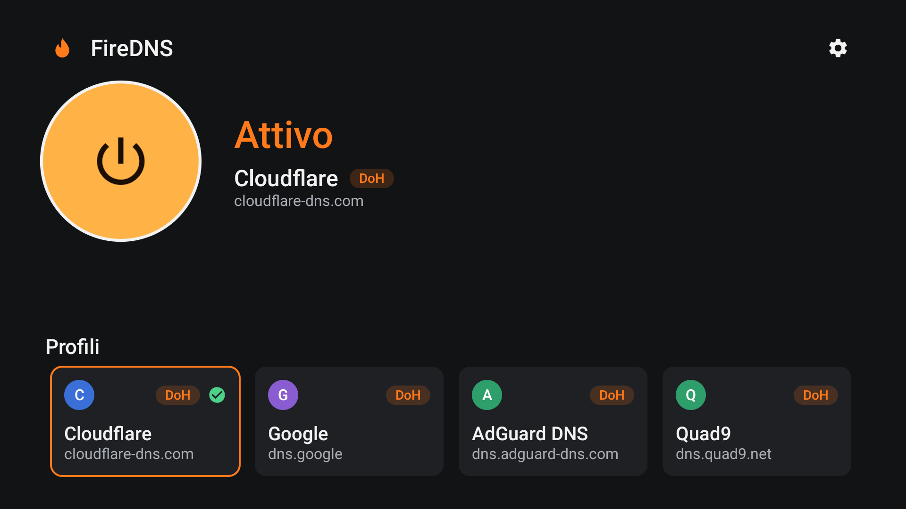
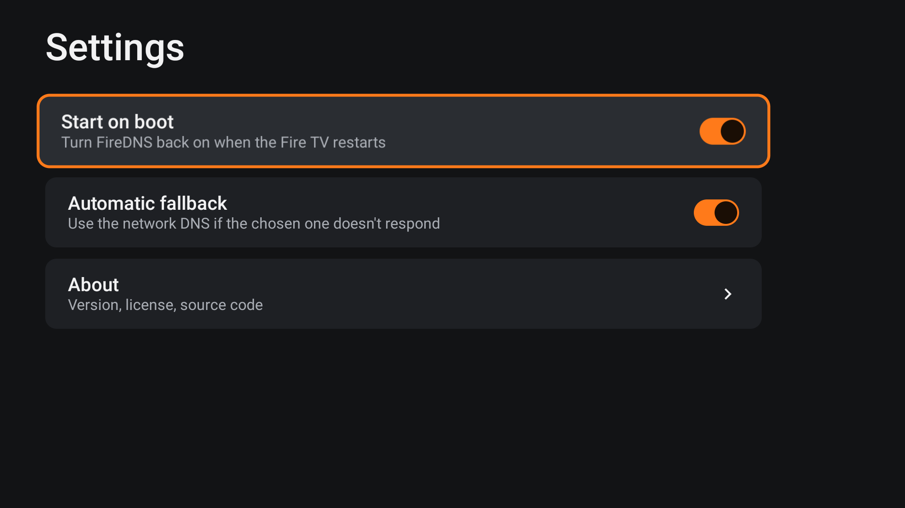
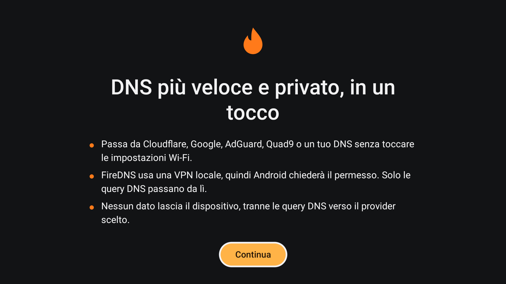

# FireDNS

**Switch DNS on your Fire TV in one click — no need to forget and reconfigure your Wi-Fi.**

FireDNS runs a small **local VPN** that captures only DNS queries and sends them to the provider you pick. Everything else goes straight to your network, untouched.

- **One-click switch** between Cloudflare, Google, AdGuard DNS and Quad9
- **Encrypted DNS** (DNS-over-HTTPS) for all built-in providers
- **Your own DNS**: add NextDNS, Pi-hole or your router by IP address or DoH URL
- **Automatic fallback** to your network DNS if the chosen provider stops answering
- **Starts on boot** and follows Wi-Fi / Ethernet changes
- **Remote-first UI** designed for the D-pad, in English and Italian
- **No accounts, no ads, no tracking**: nothing leaves your device except the DNS queries to the provider you chose

> FireDNS is meant for **privacy, ad/malware blocking and speed**. Use it in compliance with the laws of your country.

## Screenshots

| Home | Settings | First launch |
|---|---|---|
|  |  |  |

## Supported devices

Fire TV devices running **Fire OS 7 or later** (Android 9+): Fire TV Stick 4K Max, 4K, 4K Plus, HD (2024), Fire TV Cube and TVs with Fire TV built in.

**Not supported:** devices running **Vega OS** (Fire TV Stick 4K Select, Fire TV Stick HD 2nd gen), which cannot install Android apps.

Tested on: Fire TV Stick HD (1st gen), Fire OS 7.7.

## Install

**With Downloader** (recommended): install [Downloader](https://www.amazon.com/dp/B01N0BP507) from the Amazon Appstore, open it and enter the code:

```
8088747
```

or the full URL, which always points to the latest release:

```
https://github.com/downlevel/firedns/releases/latest/download/firedns.apk
```

**With adb** from a computer on the same network (enable *Settings → My Fire TV → Developer options → ADB debugging* first):

```bash
adb connect <FIRE_TV_IP>:5555
adb install -r firedns.apk
```

Open **FireDNS** from *Your Apps*, press **Continue** and accept Android's VPN permission.

## FAQ

**Why does it need VPN permission?**
Android does not let apps change the Wi-Fi DNS since Android 10. A local VPN is the only way to redirect DNS without root. FireDNS routes only DNS addresses into it: your streams and downloads never pass through the app.

**Can I use it together with another VPN?**
No. Android allows one VPN at a time. If you turn on another VPN, FireDNS stops and tells you.

**Is my data sent anywhere?**
Only your DNS queries, to the provider you selected (or to your network DNS during a fallback). There is no backend, analytics or crash reporting.

**How do I check it works?**
Select *AdGuard DNS* and open a site full of ads, or from a computer run `adb shell ping -c1 doubleclick.net`: with AdGuard it resolves to `0.0.0.0`/`127.0.0.1`, with Cloudflare to a real address.

## How it works

```
any app ── DNS query ──► 10.111.222.1 (virtual DNS, only route in the tunnel)
                               │
                        FireDNS VpnService ──► cache ──► DoH / UDP to the chosen provider
                               │                          └► network DNS (fallback)
all other traffic ─────────────┴──────────────────────────► your network, untouched
```

Details in [ARCHITECTURE.md](ARCHITECTURE.md); product and design docs: [PRD.md](PRD.md), [DESIGN.md](DESIGN.md), [TASKS.md](TASKS.md).

## Build

JDK 17 and the Android SDK (platform 35):

```bash
./gradlew ktlintCheck lint testDebugUnitTest assembleDebug
adb install -r app/build/outputs/apk/debug/app-debug.apk
```

Debug builds are signed with the committed `debug.keystore`, so every build installs over the previous one.

## Release

Pushing a `v*` tag runs `.github/workflows/release.yml`, which publishes a signed `firedns.apk` to GitHub Releases. It needs these repository secrets:

| Secret | Value |
|---|---|
| `KEYSTORE_BASE64` | `base64 -w0 firedns-release.jks` |
| `KEYSTORE_PASSWORD` | keystore password |
| `KEY_ALIAS` | key alias (e.g. `firedns`) |
| `KEY_PASSWORD` | key password |

## License

[MIT](LICENSE)
